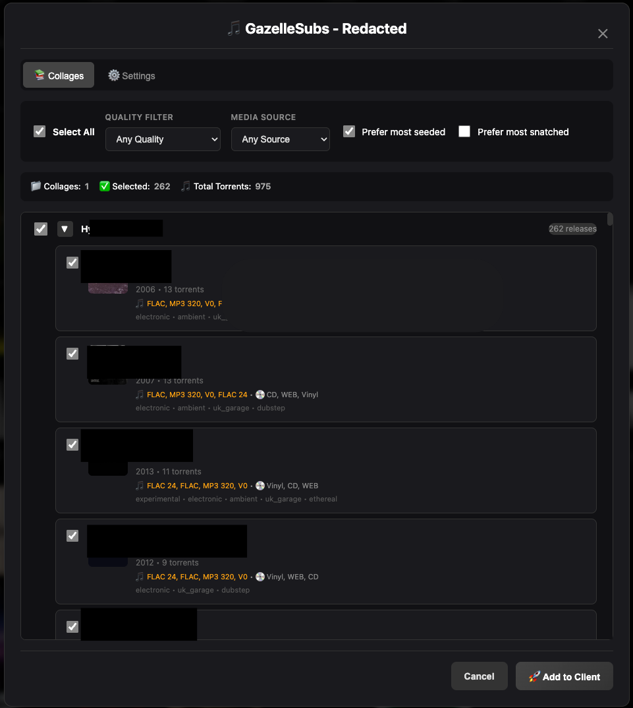

# GazelleSubs

Userscript for batch downloading from Gazelle-based music trackers. Supports both subscribed collages and individual collage pages.

Tested on Redacted and Orpheus using qBittorrent.

## Screenshots

### Subscribed Collages

| Batch Add | Settings |
|-----------|----------|
|  |  |

| Summary | Notification Catch Up |
|---------|----------------------|
|  |  |

| Group Info |
|---------|
| |

### Collage/Artist Batch Download

| Collage/Artist view |
|---------|
| |

## Features

### Subscribed Collages
- Batch download multiple releases from subscribed collages
- Browse and select individual releases or entire collages
- Filter by quality (FLAC 24bit, FLAC, MP3 320, V0, V2) and media source (CD, WEB, Vinyl, etc.)
- Prefer most seeded or most snatched torrents
- Clear collage notifications after downloading
- Multiple torrent client profiles

### Collage Batch Download
- Download releases from any collage page via the site's API
- Per-site API token configuration (Redacted and Orpheus)
- Same filtering and quality selection as subscribed collages
- Enable/disable via the ⚙️ Collage Batch Download Settings menu

### General
- Per-site rate limiting (Redacted: 10 req/10s, Orpheus: 5 req/10s)

## Supported Torrent Clients

- qBittorrent
- Transmission
- Deluge
- Flood
- ruTorrent

## Installation

1. Install [Tampermonkey](https://www.tampermonkey.net/) or [Greasemonkey](https://www.greasespot.net/)
2. Install the userscript from the dist folder: `GazelleSubs.user.js`

## Usage

### Subscribed Collages
1. Navigate to your subscribed collages page
2. Click the "Batch Download" button in the bottom-left corner
3. Configure your torrent client in the Settings tab (first time only)
4. Select releases and quality preferences
5. Click "Add to Client"

### Collage Batch Download
1. Open the script menu and go to **⚙️ Collage Batch Download Settings**
2. Enable the collage view widget and add your API token for each site
3. Navigate to any collage page
4. Click the "Batch Download" button in the bottom-left corner
5. Browse releases, select what you want, and click "Add to Client"

> **Note:** API tokens can be generated in your profile settings on each site (Edit Profile → API Tokens → Create Token).

## Building from Source

```bash
npm install
npm run build
```

The built userscript will be in the `dist` folder.

## Credits

The torrent client integration is based on [SendToClient](https://github.com/notmarek/SendToClient) by notmarek.

## License

MIT
